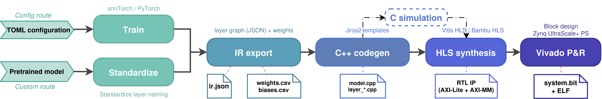

# SNN2Bitstream

**Automated Model-to-FPGA HLS-Based Framework for Spiking Neural Network Hardware Accelerators**

SNN2Bitstream compiles a Spiking Neural Network trained in [snnTorch](https://snntorch.readthedocs.io/) into an FPGA bitstream for the AMD/Xilinx ZCU104, based on HLS tools. It generates readable, HLS-friendly C++, lets you verify it with GCC before synthesis, and supports both **Vitis HLS** and the open-source **Bambu HLS**.



## Installation

**Python** (tested with Python 3.10):

```bash
pip install -r requirements.txt
```

**Hardware tools**, required only to reach a bitstream and the board application:

| Tool | Version validated | Used for |
|------|-------------------|----------|
| AMD Vitis HLS | 2020.2 | high-level synthesis (default backend) |
| AMD Vivado | 2020.2 | block design, implementation, bitstream |
| AMD Vitis (`xsct`) | 2020.2 | bare-metal application ELF |
| PandA Bambu HLS | 2024.10 | optional open-source HLS backend |

Put them on `PATH` (source the Xilinx `settings64.sh`). The 2020.2 release also needs AMD's Y2K22 patch for HLS IP export (AMD Answer Record 76960); without it the IP export step fails. Other versions are untested.

## Quick start

```bash
# Software flow only: train → IR → C++ → GCC test
./snn2bitstream sw --toml configs/mnist_fcn_rate.toml

# Full flow to bitstream: SW + HLS + Vivado
./snn2bitstream full --toml configs/mnist_fcn_rate.toml

# Hardware only, on an already-generated project
./snn2bitstream hw <project_name>
```

`./snn2bitstream` forwards to `script/run_all.sh`; either name works.

Datasets download on demand, e.g. `python tools/download_data.py mnist`.

## Configuration

All options can be given on the command line or in the TOML `[codegen]` section (CLI wins).

| Flag | Values | Meaning |
|------|--------|---------|
| `--config` | `S` \| `SP` \| `SQ` \| `SPQ` | `S` baseline; `+P` HLS pragmas; `+Q` quantization. `SPQ` = full. |
| `--quant` | `qat_ft` \| `qat` \| `ptq` | Quantization method (`qat_ft`, QAT fine-tuning from a float model, is the default and most accurate). |
| `--quant-bits` | `2`–`16` (default `8`) | Weight/activation bit width. `4` and `8` are validated; above `8` is accepted with a warning. |
| `--unroll` | `ck` | Convolution kernel unrolling: kernel loops + weight partitioning. |
| `--sparse` | (flag) or `sp` | Spike-driven sparsity in FC layers. |
| `--backend` | `vitis` \| `bambu` | HLS backend (default `vitis`; `bambu` is open-source). |

[Bambu](https://github.com/ferrandi/PandA-bambu) is the open-source HLS tool of the [PandA framework](https://panda.dei.polimi.it/) (Politecnico di Milano); see its repository for installation. Bambu tuning goes in the TOML: `[codegen.bambu]` with `opt = "-O3"` and `extra = "..."`. The presence of that section also selects the backend, so `--backend bambu` on its own runs Bambu at its defaults.

### Advanced options

| Flag | Meaning |
|------|---------|
| `--data-width W` / `--data-int-width I` | Fixed-point type `ap_fixed<W,I>` (default 32-bit; `I` defaults to `W/2`). |
| `--bit-shift-beta` | LIF leak as a bit shift instead of a multiply. |
| `--mul-impl-fabric` | Multiplies on LUTs instead of DSPs (binary-input FC only). |
| `--streaming` | Per-stage AXI-Stream design. |
| `--parallel-factor N` | FC unroll factor (default 8). |
| `--pretrained <ckpt>` | Start from an existing FP32 checkpoint (config route). |
| `--project <name>` | Write the output to a separate project directory. |
| `--input-shape C,H,W` | Input shape, required for Conv2d models on the custom route. |
| `--input-is-binary` | Treat the input as binary spikes (custom route, rate-coded input only). |

## Custom route

Deploy your own pre-trained snnTorch model. Put the model class in a Python file, e.g. `user_model/my_model.py`, and pass it as a module path together with its weights:

```bash
# FCN (input dim auto-detected)
./snn2bitstream sw --custom user_model.my_model.MyFCN \
    --weights user_model/my_fcn.pt --project myfcn --timestep 10 --dataset nmnist

# CSNN (Conv2d models need --input-shape C,H,W)
./snn2bitstream sw --custom user_model.my_model.MyCSNN \
    --weights user_model/my_csnn.pt --project mycsnn --timestep 10 \
    --dataset nmnist --input-shape 2,34,34 --config SPQ
```

Support for custom models is currently limited.

## Examples

```bash
./snn2bitstream full --toml configs/mnist_fcn_rate.toml --mul-impl-fabric
```

Target board is the AMD ZCU104 (XCZU7EV Zynq UltraScale+ MPSoC) at 100 MHz.

## Repository layout

| Path | Contents |
|------|----------|
| `frontend/` | training (`train_model.py`), QAT (`qat.py`), model standardization, IR export, model templates |
| `converter/` | IR → C++ code generation (`converter.py`) and Jinja2 templates (`templates_stage/`, `templates_streaming/`, `templates_bambu/`) |
| `script/` | pipeline entry points (`run_all.sh`, `run_config_sw.sh`, `run_custom_sw.sh`, `run_xilinx.sh`) |
| `tools/` | dataset download, test-data export, C test harnesses |
| `configs/` | example TOML configuration |
| `docs/` | figures used in this README |

Generated output (all gitignored):

| Path | Contents |
|------|----------|
| `backend_projects/<project>/cpp/` | generated C++, the compiled GCC test, `sw_report.txt` |
| `backend_projects/<project>/xilinx/` | Vitis HLS + Vivado projects, `post_place_report.txt`, bitstream |
| `ir_output/<project>/` | `ir.json` and the weight/bias CSVs |
| `checkpoints/` | trained checkpoints and per-run accuracy logs |

## Running on the board

`full` and `hw` also build the application ELF. To measure accuracy on the FPGA, copy the test set to an SD card:

```bash
python tools/export_mnist_bin.py test_data/mnist --encoding rate --timesteps 10   # MNIST only
python tools/prep_sd_data.py <project_name> --sd <SD_ROOT>
```

Then open the Vitis workspace `backend_projects/<project_name>/xilinx/vitis_<project_name>/` (`bambu/` instead of `xilinx/` for Bambu), run the ELF on the board over JTAG.

## Publication

The article introducing *SNN2Bitstream* has been accepted for presentation at the IEEE International Conference on Artificial Intelligence Circuits and Systems (AICAS) 2026.

### Citation

To cite our work, please use the following citation:

> X. Zhang, I. Kaskampas, A. Pinna and H.-G. Stratigopoulos, _"SNN2Bitstream: Automated Model-to-FPGA HLS-Based Framework for Spiking Neural Network Hardware Accelerators,"_ IEEE International Conference on Artificial Intelligence Circuits and Systems (AICAS), 2026.

```bibtex
@inproceedings{zhang2026snn2bitstream,
      title={SNN2Bitstream: Automated Model-to-FPGA HLS-Based Framework for Spiking Neural Network Hardware Accelerators},
      author={Xindan Zhang and Ioannis Kaskampas and Andrea Pinna and Haralampos-G. Stratigopoulos},
      booktitle={IEEE International Conference on Artificial Intelligence Circuits and Systems (AICAS)},
      year={2026},
}
```

## Acknowledgments

This work has been funded by the French National Research Agency (ANR) France 2030 AdaptING project (Grant No ANR-23-PEIA-0009).

## License & Copyright

Xindan Zhang is the Author of the Software <br>
Copyright 2026 Sorbonne Université, Centre National de la Recherche Scientifique

*SNN2Bitstream* is free software: you can redistribute it and/or modify it under the terms of GNU General Public License version 3 as published by the Free Software Foundation.

*SNN2Bitstream* is distributed in the hope that it will be useful, but WITHOUT ANY WARRANTY; without even the implied warranty of MERCHANTABILITY or FITNESS FOR A PARTICULAR PURPOSE. See the GNU General Public License for more details.

You will find in the LICENSE file a copy of the GNU General Public License version 3.
